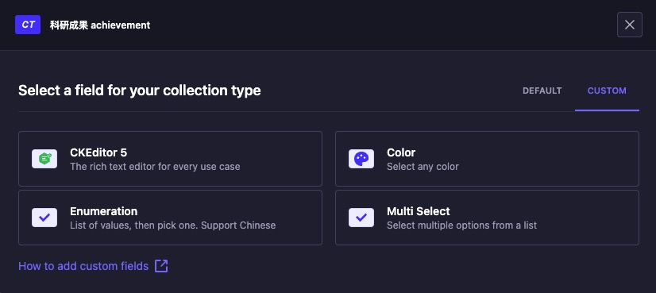
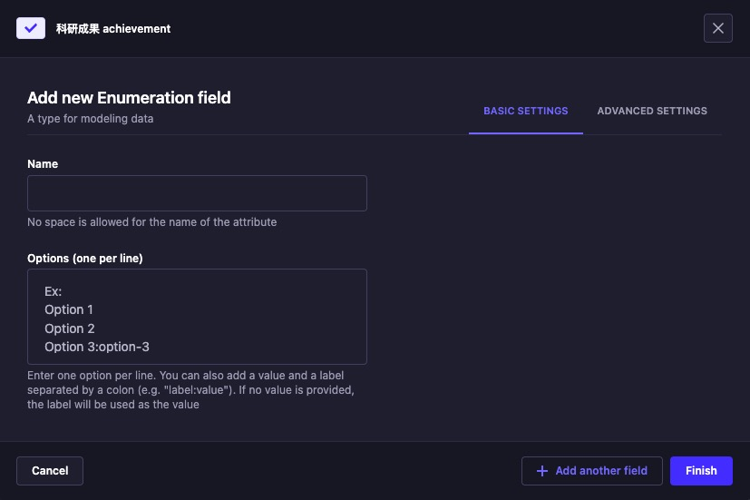
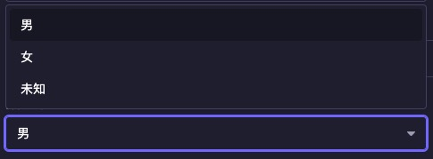

# 修复了原始的插件不符合短横线分隔规范 Plugin name "custom enumeration" is not in kebab-case

# Strapi plugin custom enumeration

Supper chinese.
支持中文的枚举

### CHANGELOG

改了一下 strapi-plugin-multi-select，改成单选了

```
# Using Yarn
yarn add strapi-plugin-custom-enumeration

# Or using NPM
npm install strapi-plugin-custom-enumeration
```

Then, you'll need to build your admin panel:

```
# Using Yarn
yarn build

# Or using NPM
npm run build
```

## Usage






